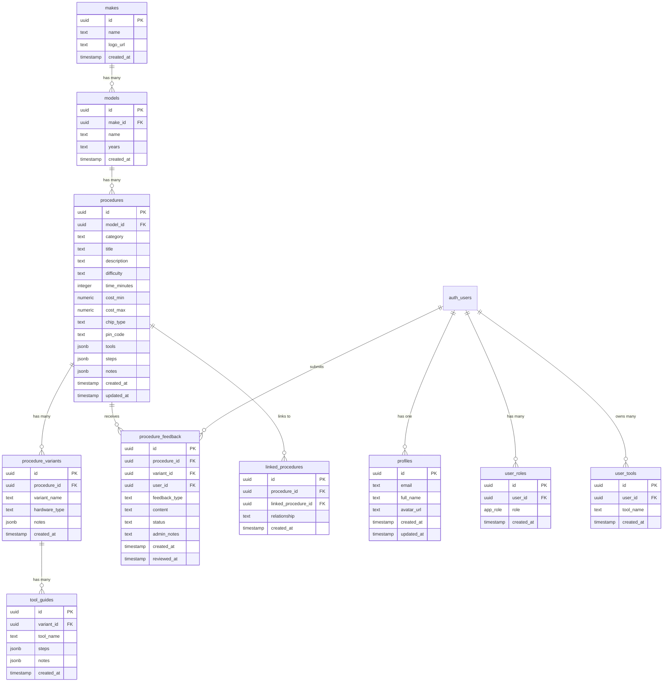

# Database Schema Documentation

## Overview

This is a **vehicle service procedure database** designed for automotive technicians. It stores step-by-step guides for key programming, ECU cloning, dashboard repairs, and immobilizer services.

---

## Entity Relationship Diagram



---

## Data Hierarchy

```
Make (e.g., "BMW", "Mercedes", "Audi")
  └── Model (e.g., "E90 3-Series", "W204 C-Class")
        └── Procedure (e.g., "All Keys Lost Programming")
              ├── Variant (e.g., "CAS3", "CAS3+", "FEM/BDC")
              │     └── Tool Guide (e.g., "Using VVDI2", "Using Autel IM608")
              ├── Linked Procedures (related work)
              └── Feedback (user tips, corrections, issues)
```

---

## Core Tables Explained

### 1. `makes` - Vehicle Manufacturers

Stores car brands/manufacturers.

| Column | Type | Description |
|--------|------|-------------|
| `id` | uuid | Primary key |
| `name` | text | Brand name (e.g., "BMW", "Audi") |
| `logo_url` | text | URL to manufacturer logo |
| `created_at` | timestamp | Record creation time |

**Example data:**
```json
{ "name": "BMW", "logo_url": "https://..." }
{ "name": "Mercedes-Benz", "logo_url": "https://..." }
```

---

### 2. `models` - Vehicle Models

Stores specific vehicle models under each make.

| Column | Type | Description |
|--------|------|-------------|
| `id` | uuid | Primary key |
| `make_id` | uuid | Foreign key to `makes` |
| `name` | text | Model name (e.g., "E90 3-Series") |
| `years` | text | Year range (e.g., "2005-2011") |
| `created_at` | timestamp | Record creation time |

**Example data:**
```json
{ "make_id": "bmw-uuid", "name": "E90 3-Series", "years": "2005-2011" }
{ "make_id": "bmw-uuid", "name": "F30 3-Series", "years": "2012-2019" }
```

---

### 3. `procedures` - Service Procedures

The main table storing service procedures for each model.

| Column | Type | Description |
|--------|------|-------------|
| `id` | uuid | Primary key |
| `model_id` | uuid | Foreign key to `models` |
| `category` | text | Service type: `key-programming`, `ecu-cloning`, `dashboard`, `immo-off` |
| `title` | text | Procedure title |
| `description` | text | Brief description |
| `difficulty` | text | `easy`, `medium`, `hard`, `expert` |
| `time_minutes` | integer | Estimated time in minutes |
| `cost_min` | numeric | Minimum cost estimate |
| `cost_max` | numeric | Maximum cost estimate |
| `chip_type` | text | Chip/transponder type (e.g., "PCF7945") |
| `pin_code` | text | Default PIN or how to obtain it |
| `tools` | jsonb | Array of required tools |
| `steps` | jsonb | Array of procedure steps |
| `notes` | jsonb | Array of important notes/warnings |
| `created_at` | timestamp | Record creation time |
| `updated_at` | timestamp | Last update time |

**Tools JSON structure:**
```json
[
  { "name": "VVDI2", "required": true },
  { "name": "ELV Emulator", "required": false }
]
```

**Steps JSON structure:**
```json
[
  "Connect diagnostic tool to OBD port",
  "Read ISN from DME",
  "Generate dealer key using VVDI2"
]
```

**Categories explained:**
- `key-programming` - Adding/programming new keys
- `ecu-cloning` - Copying ECU data to replacement unit
- `dashboard` - Instrument cluster repairs/programming
- `immo-off` - Immobilizer removal/bypass

---

### 4. `procedure_variants` - Hardware Variations

Different hardware versions may require different steps.

| Column | Type | Description |
|--------|------|-------------|
| `id` | uuid | Primary key |
| `procedure_id` | uuid | Foreign key to `procedures` |
| `variant_name` | text | Variant name (e.g., "CAS3", "CAS3+") |
| `hardware_type` | text | Hardware identifier |
| `notes` | jsonb | Variant-specific notes |
| `created_at` | timestamp | Record creation time |

**Why variants exist:**
A BMW E90 might have CAS2, CAS3, or CAS3+ depending on production date. Each requires different steps.

---

### 5. `tool_guides` - Tool-Specific Instructions

Different tools require different steps for the same procedure.

| Column | Type | Description |
|--------|------|-------------|
| `id` | uuid | Primary key |
| `variant_id` | uuid | Foreign key to `procedure_variants` |
| `tool_name` | text | Tool name (e.g., "VVDI2", "Autel IM608") |
| `steps` | jsonb | Tool-specific steps |
| `notes` | jsonb | Tool-specific notes |
| `created_at` | timestamp | Record creation time |

**Flow:** User selects variant → then selects their tool → sees specific steps.

---

### 6. `linked_procedures` - Related Procedures

Links procedures that are commonly done together.

| Column | Type | Description |
|--------|------|-------------|
| `id` | uuid | Primary key |
| `procedure_id` | uuid | Source procedure |
| `linked_procedure_id` | uuid | Related procedure |
| `relationship` | text | Type: `related`, `prerequisite`, `follow-up` |
| `created_at` | timestamp | Record creation time |

**Example:** "All Keys Lost" might link to "ELV Repair" as a follow-up.

---

### 7. `procedure_feedback` - User Contributions

Users can submit tips, corrections, or report issues.

| Column | Type | Description |
|--------|------|-------------|
| `id` | uuid | Primary key |
| `procedure_id` | uuid | Foreign key to `procedures` |
| `variant_id` | uuid | Optional: specific variant |
| `user_id` | uuid | Submitting user |
| `feedback_type` | text | `tip`, `correction`, `issue` |
| `content` | text | Feedback content |
| `status` | text | `pending`, `approved`, `rejected` |
| `admin_notes` | text | Admin review notes |
| `created_at` | timestamp | Submission time |
| `reviewed_at` | timestamp | Review time |

---

## User Tables

### 8. `profiles` - User Profiles

Extended user information (linked to auth.users).

| Column | Type | Description |
|--------|------|-------------|
| `id` | uuid | Primary key (matches auth.users.id) |
| `email` | text | User email |
| `full_name` | text | Display name |
| `avatar_url` | text | Profile picture URL |
| `created_at` | timestamp | Account creation |
| `updated_at` | timestamp | Last profile update |

**Auto-created** via trigger when user signs up.

---

### 9. `user_roles` - Role-Based Access

Controls admin vs regular user permissions.

| Column | Type | Description |
|--------|------|-------------|
| `id` | uuid | Primary key |
| `user_id` | uuid | Foreign key to auth.users |
| `role` | app_role | Enum: `admin` or `user` |
| `created_at` | timestamp | Role assignment time |

**Security:** Checked via `has_role()` function in RLS policies.

---

### 10. `user_tools` - User's Tool Inventory

Tracks which tools each user owns.

| Column | Type | Description |
|--------|------|-------------|
| `id` | uuid | Primary key |
| `user_id` | uuid | Foreign key to auth.users |
| `tool_name` | text | Tool name |
| `created_at` | timestamp | When added |

**Future use:** Filter procedures by tools user owns.

---

## Security Model (RLS)

| Table | Public Read | User Write | Admin Write |
|-------|-------------|------------|-------------|
| makes | ✅ | ❌ | ✅ |
| models | ✅ | ❌ | ✅ |
| procedures | ✅ | ❌ | ✅ |
| procedure_variants | ✅ | ❌ | ✅ |
| tool_guides | ✅ | ❌ | ✅ |
| linked_procedures | ✅ | ❌ | ✅ |
| procedure_feedback | ✅ (approved only) | Own only | ✅ |
| profiles | Own only | Own only | ❌ |
| user_roles | Own only | ❌ | ✅ |
| user_tools | Own only | Own only | ❌ |

---

## Database Functions

### `has_role(user_id, role)`
Checks if a user has a specific role. Used in RLS policies.

```sql
has_role(auth.uid(), 'admin'::app_role) -- Returns true/false
```

### `handle_new_user()`
Trigger function that creates a profile when a user signs up.

### `update_updated_at_column()`
Trigger function that updates `updated_at` on record changes.

---

## Typical Data Flow

1. **Admin creates:** Make → Model → Procedure → Variants → Tool Guides
2. **User browses:** Selects Make → Model → Procedure → Variant → Tool
3. **User contributes:** Submits feedback (pending admin approval)
4. **Admin moderates:** Reviews feedback, approves/rejects
